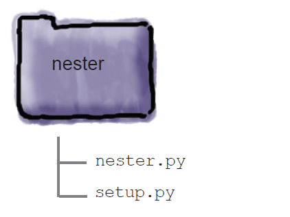
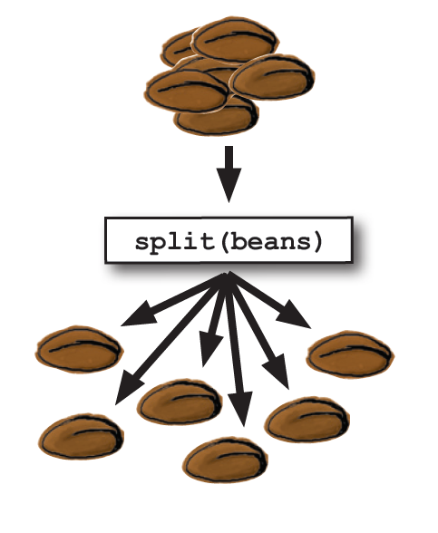
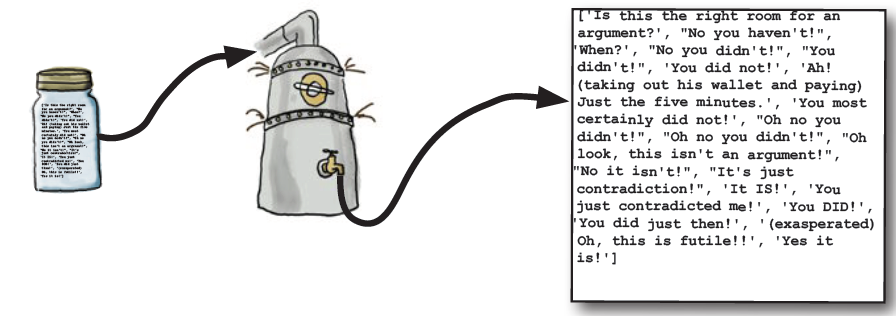

[(Home)](https://github.com/DoranLyong/Python_study) 
[(back)](https://github.com/DoranLyong/Python_study/tree/master/1_regular/Head_First_Python)

# Head First Python (2011 ver)
총 7단계를 거치면서 파이썬의 맛을 체험할 수 있습니다:  

### 1. 파이썬과의 첫 만남 
* \<list> 자료 구조를 통해 파이썬 데이터가 운용되는 방식을 익힌다. 
* but, 데이터를 가지고 놀다보니 코드가 반복되면서 복잡성이 늘어난다. 
    > 코드 재사용을 위한 '파이썬 함수' 정의를 해보자 

  

### 2. 코드 공유하기 (함수 모듈)
* 내가 정말 쩌는 함수 코드를 만들었다. 혼자 쓰기 너무 아까우니 공유해야겠다. 
* 코드를 '모듈화modularity'해서 커뮤니티에 배포하자 
* 그리고 남들이 올려놓은 모듈도 설치해서 써보자.  

※ 모듈이 모이면 = package 

  

### 3. 파일과 예외 (에러 처리)
* 프로그래밍의 시작은 데이터를 원활하게 가져오는 것에서 부터 시작한다. 
* 하지만, 언제나 사건에는 예외가 존재한다.
* 끔찍한 에러가 발생했을 때 이를 해결할 <b>예외 처리</b>기법을 익히자.  

  

### 4. 영속성 (파일에 데이터 저장하기)
* 메모리에 있는 데이터는 프로그램이 끝나면 휘발되어 사라진다. 
* 이 데이터를 영원히 사용하려면 저장소storage에 저장해야 한다. 
* 파이썬 데이터를 저장소에 저장하는 형태로 .pickle을 사용한다. 
    > 데이터 변환 과정을 <b>피클링</b>이라고 부름  
    > 이진화 데이터(binary data)로 바꾸어 저장함 

