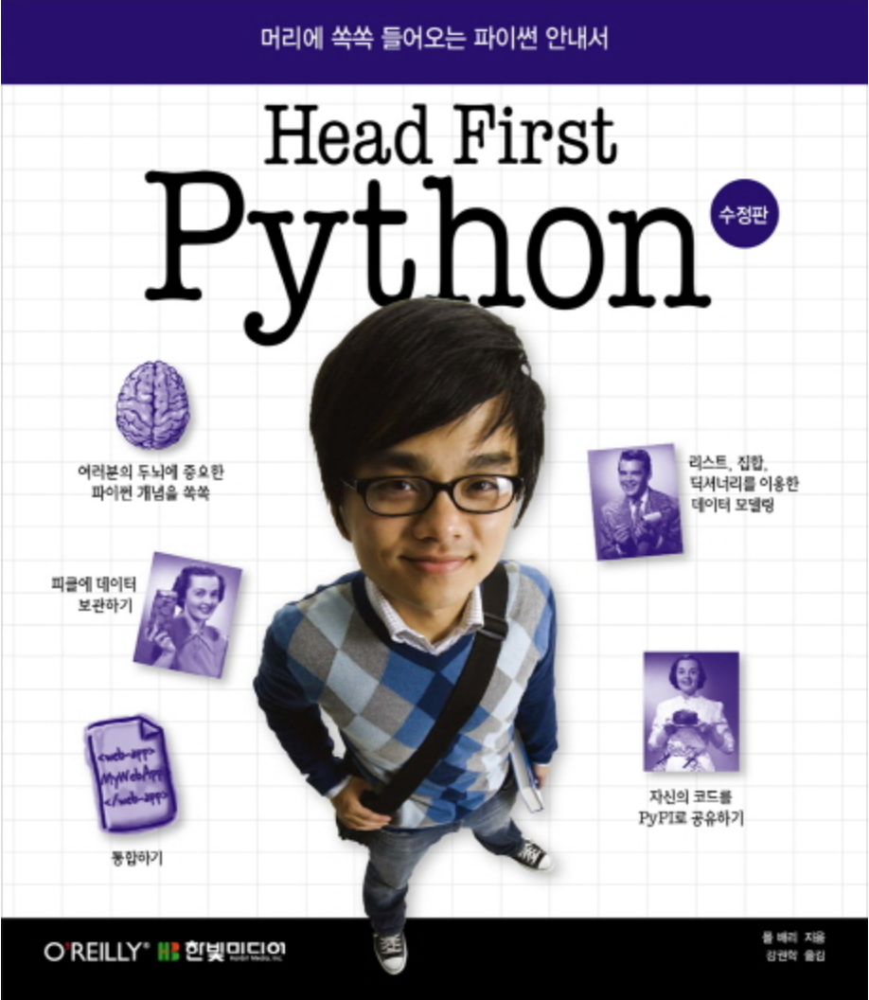
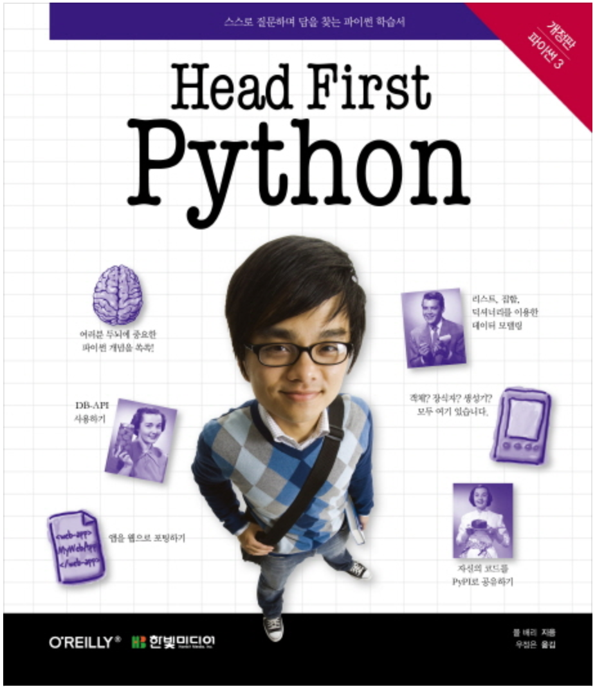

[(Home)](https://github.com/DoranLyong/Python_study)  
[(back)](https://github.com/DoranLyong/Python_study/tree/master/1_regular)

# Head First Python 
2010년에 출판되어 2011년에 번역된 수정판이 나왔다.   이 책의 경우 Python을 활용해 어떻게 코드를 구성할 수 있는지를 알려준다. 책의 두께가 얇은 만큼 백과사전 처럼 Python의 모든 내용을 담고있지는 않지만, 자주 사용되는 코드 용법과 프로그래밍 패턴을 읶힐 수 있다.  
예상 독자는 이미 프로그래밍 지식이 있으면서 파이썬이라는 새로운 언어를 사용하고 싶어 하는 사람을 대상으로 한다. 

 
2016년에 좀더 두꺼운 버전의 책이 출판됐다. 두께로 보아 이전 보다 더 많은 내용을 담고 있을 것 같다. 추후에 구매해서 또 정리해야겠다.   

### (1) 2011년 수정판 정리 
### (2) 2016년 판 정리  

##

